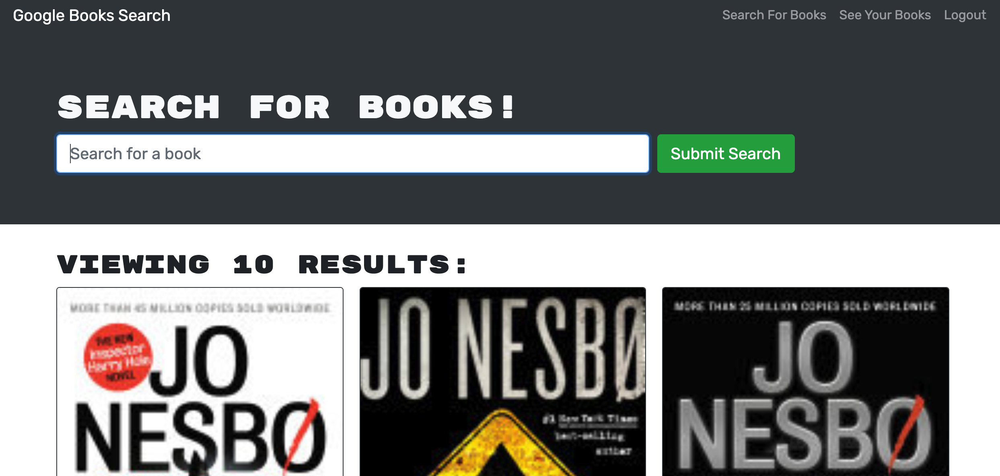

<h1 align="center">Google Search based Book Search Engine 👋</h1>

 

## Description
🔍 Book search engine(based off Google Search API) and save web application

## Table of Contents
- [Description](#description)
- [Installation](#installation)
- [Usage](#usage)
- [Deployment](#deployment)
- [Screenshots](#screenshots)
- [License](#license)
- [Contributing](#contributing)
- [Questions](#questions)

## Installation
💾 npm install

## Usage
💻 npm start

## Deployment
🛳 [Application Link](https://book-searchengine.herokuapp.com/)

## Screenshots  
  

## License

 
This application is covered by the MIT license. 

## Contributing
👪 Sparsh Patwa

## Questions
✋ Feel free to reach out with question or comments  
:octocat: Find me on GitHub: [SparshPatwa](https://github.com/SparshPatwa)  
✉️ Email me with any questions: patwa.sparsh@gmail.com
